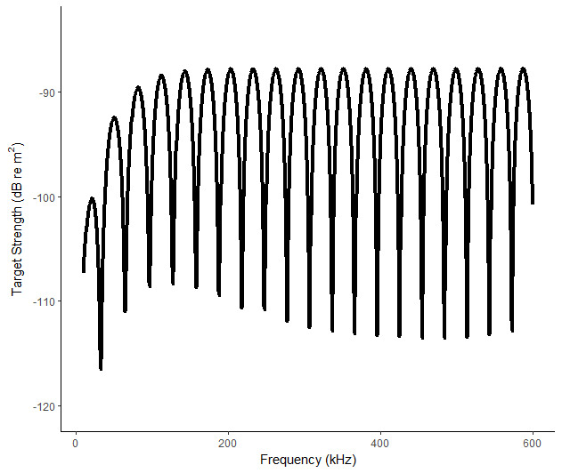
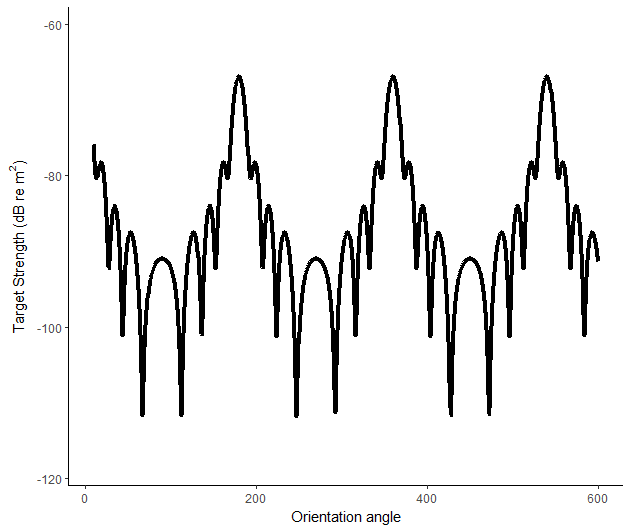
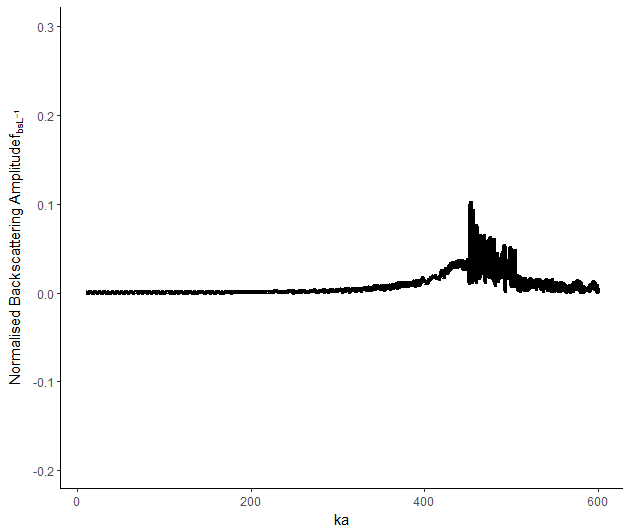
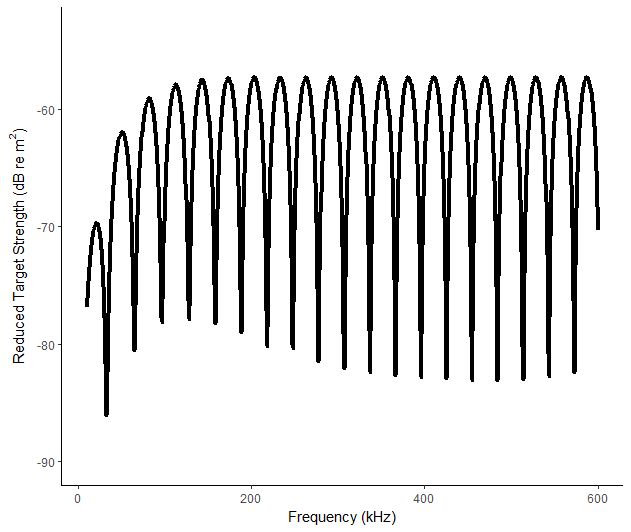
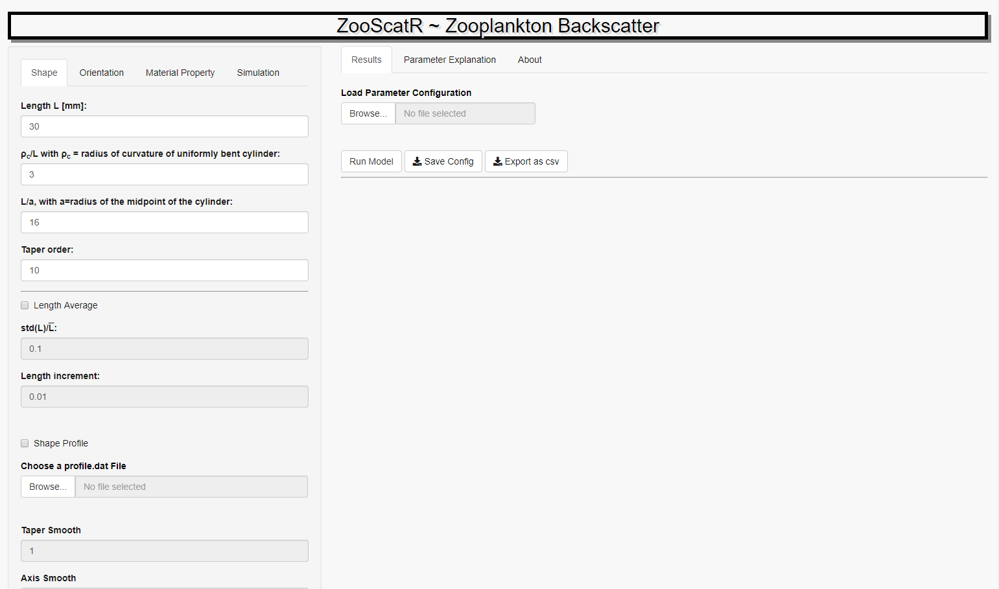

# ZooScat 

## Overview
ZooScat is an implementation of the Distorted Wave Born Approximation (DWBA) model for the simulation of acoustic scattering by weak scattering targets inside a fluid.  
It includes a shiny web application called DWBAapp for easy model parametrisation and result visualisation as well as the option to run the DWBA model from the command line. Additional functions to compute soundspeed in water, water density and Spherical Bessel functions with their derivatives (as needed in the analytical solution of a weakly scattering sphere, e.g. Neumann and Hankel functions).    

## Copyright and Licence  


    Copyright (C) 2018 Sven Gastauer, Dezhang Chu, Martin Cox.
    
    This file is part of ZooScat.
    
    ZooScat is free software: you can redistribute it and/or modify
    it under the terms of the GNU General Public License as published by
    the Free Software Foundation, either version 3 of the License, or
    (at your option) any later version.
    
    ZooScat is distributed in the hope that it will be useful,
    but WITHOUT ANY WARRANTY; without even the implied warranty of
    MERCHANTABILITY or FITNESS FOR A PARTICULAR PURPOSE.  See the
    GNU General Public License for more details.
    
    You should have received a copy of the GNU General Public License
    along with ZooScat.  If not, see <http://www.gnu.org/licenses/>.
    This package is open for community development and we encourage users to extend the package as they need. We are not liable for any losses when using ZooScat.
  

If using ZooScat, please cite as:  

``` r
citation('ZooScat')
```

## Installation  

ZooScat can be installed form GitHub. This requires the [devtools](https://cran.r-project.org/web/packages/devtools/index.html) package.

``` r
# The package can be installed from Github:
# install.packages("devtools")
devtools::install_github("AustralianAntarcticDivision/ZooScat")
```
### Dependencies  

ZooScat currently depends on: 
  
* [shiny](https://shiny.rstudio.com/) - to build the shiny app
* [shinyjs](https://cran.r-project.org/web/packages/shinyjs/index.html) - for some features like showing/hiding tabs inside the shiny app
* [ggplot2](https://cran.r-project.org/web/packages/ggplot2/index.html) - for nicer plots
* [reshape2](https://cran.r-project.org/web/packages/reshape2/index.html) - for easy reshaping of datframes to be plotted in ggplot2
* [pracma](https://cran.r-project.org/web/packages/pracma/index.html) - for some Matlab-like mathematical operations  

These dependencies should be installed automatically, if unavailable when ZooScat is installed. If not, the missing libraries can be installed through:  

``` r
packages <- c("shiny","shinyjs","ggplot2", "reshape2","pracma")
if (length(setdiff(packages, rownames(installed.packages()))) > 0) {
  install.packages(setdiff(packages, rownames(installed.packages())))}
```

## Usage - Quick Start  
  
For a quick start, a minimal example:  

``` r
fname <- paste0(system.file(package="ZooScat"),"/extdata/configs/config_0.dat") #Loacation of the parameters file
para = read_para(fname) #Read parameters file
#Create list with soundspeed info
misc <- list(cw=1500)
#Run DWBA based on config file
res <- bscat(para=para, misc=misc) #Target strength vs Frequency
res$rplot #Show the result plot
```  

<!-- -->

``` r
#Target strength vs angular position
para$simu$var_indx <- 2 #Set output variable to Angular position
#Run DWBA based on config file
res <- bscat(para=para, misc=misc)
res$rplot #Show the result plot
```  

<!-- -->

``` r
#Backscattering amplitude vs ka (Wavenumber x width)
para$simu$out_indx <- 1 #Set output to Backscattering amplitude
para$simu$var_indx <- 3 #Set output variable to ka
#Run DWBA based on config file
res <- bscat(para=para, misc=misc)
res$rplot #Show the result plot
```  

<!-- -->

``` r
#Reduced Target Strength vs Frequency (Wavenumber x width)
para$simu$out_indx <- 4 #Set output to Reduced Target Strength
para$simu$var_indx <- 1 #Set output variable to Frequency
#Run DWBA based on config file
res <- bscat(para=para, misc=misc)
res$rplot #Show the result plot
```  

<!-- -->

``` r
#Run the DWBA shiny app
DWBAapp()
```  
It is recommended to view the app in a browser like Chromium, Chrome or Firefox for better visualisation and user experience, rather than the R preview window.  

<!-- -->

## Available vignettes  

Currently the following vignettes are available:  

* [A general introduction to the DWBA model, with examples on how to run the DWBA model inside ZooScat from the command](man/figures/DwbaCommand.html)  
* [A description of the DWBA web application](man/figures/DWBAapp_vignette.html)
* [A validation of the model implication within ZooScat through comparison with an analytical solution of the sphere case](man/figures/CompareToAnalyticalSolution.html)  
* [An a bit more advanced tutorial on how to run multiple DWBA instance in parallel using multiple cores](man/figures/DWBAParallel.html)  

## Getting help  
For ZooScat specific questions make a feature request or post an issue on [GitHub](https://github.com/AustralianAntarcticDivision/ZooScat).    
For general R questions visit [Stack Overflow](https://stackoverflow.com/questions/tagged/r).  
If none of those options seem appropriate and you are getting really desperate, contact one the authors.  
